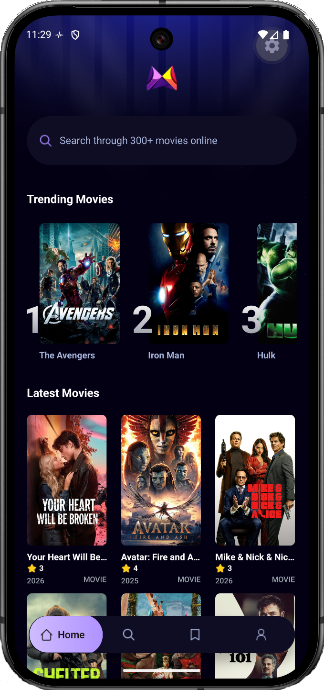

# Movie Scope

**Discover, save, and track movies in one place.**

Movie Scope is a mobile app built with [Expo](https://expo.dev/) and [React Native](https://reactnative.dev/). Browse trending and latest titles from TMDB, search the catalog, build a personal library (favorites, watchlist, watched), and keep a profile with stats and preferences—all wrapped in a dark, minimal UI styled with [NativeWind](https://www.nativewind.dev/).



## Repository

**GitHub:** [https://github.com/aniltanriverdiler/movie-scope-app](https://github.com/aniltanriverdiler/movie-scope-app.git)

```bash
git clone https://github.com/aniltanriverdiler/movie-scope-app.git
cd movie-scope-app
```

## Features

- **Home** — Trending movies (via [Appwrite](https://appwrite.io/)) and a discoverable grid of latest movies.
- **Search** — Debounced TMDB search with live results.
- **Movie details** — Full overview, ratings, genres, and actions to favorite, add to watchlist, or mark as watched.
- **Library (Save)** — Tabbed lists (favorites, watchlist, watched), sorting, stats, and a horizontal “recently viewed” style flow driven by Redux.
- **Profile** — User header, stats (watched, favorites, watchlist, top genre), gamification progress, preferences, optional avatar from the gallery ([expo-image-picker](https://docs.expo.dev/versions/latest/sdk/image-picker/)), and logout placeholder.
- **Offline-first library** — [Redux Toolkit](https://redux-toolkit.js.org/) for state; [AsyncStorage](https://react-native-async-storage.github.io/async-storage/) persistence with a tiny custom hydrate/rehydrate layer (no `redux-persist`).

## Tech stack

| Area | Choices |
|------|---------|
| App | Expo ~55, React 19, React Native, [Expo Router](https://docs.expo.dev/router/introduction/) (file-based routing) |
| Styling | [NativeWind](https://www.nativewind.dev/) v4 (Tailwind for React Native) |
| State | Redux Toolkit + React Redux |
| Persistence | AsyncStorage (saved movies + profile) |
| APIs | TMDB (movies), Appwrite (trending / search analytics) |
| Images | expo-image, expo-image-picker |

## Project structure (high level)

```
movie-scope-app/
├── src/
│   ├── app/                    # Expo Router: layouts, tabs, movie/[id]
│   │   ├── (tabs)/             # Home, Search, Save, Profile
│   │   └── movie/
│   ├── components/             # MovieCard, LibraryMovieCard, ProfileHeader, etc.
│   ├── constants/
│   ├── services/               # API fetch, Appwrite, useFetch
│   ├── store/                  # Redux store, slices, persist helpers
│   └── utils/
├── assets/images/              # Icons, splash, readme screenshot
├── app.json
├── tailwind.config.js
└── package.json
```

## Prerequisites

- **Node.js** 18+ (recommended)
- **Bun**, npm, yarn, or pnpm for dependency installation
- A **TMDB** API token (Bearer) for movie data
- An **Appwrite** project (optional but used for trending/search features in the repo)

## Environment variables

Create a `.env.local` in the project root (never commit real secrets):

| Variable | Purpose |
|----------|---------|
| `EXPO_PUBLIC_MOVIE_API_KEY` | TMDB API read token (Bearer) |
| `EXPO_PUBLIC_APPWRITE_PROJECT_ID` | Appwrite project ID |
| `EXPO_PUBLIC_APPWRITE_DATABASE_ID` | Appwrite database ID |
| `EXPO_PUBLIC_APPWRITE_COLLECTION_ID` | Appwrite collection for trending/search |

## Setup

1. **Install dependencies** (this repo uses a `bun.lock`; use Bun, npm, or your preferred client):

   ```bash
   bun install
   ```

2. **Add `.env.local`** with the variables above.

3. **Start the dev server**:

   ```bash
   bun start
   ```

   Or:

   ```bash
   npx expo start
   ```

   Then open the app in Expo Go, an iOS simulator, Android emulator, or web as prompted.

### Scripts

| Command | Description |
|---------|-------------|
| `bun start` / `npm start` | Start Expo dev server |
| `bun run ios` / `npm run ios` | Start with iOS target |
| `bun run android` / `npm run android` | Start with Android target |
| `bun run web` / `npm run web` | Start with web target |
| `bun run lint` / `npm run lint` | Run Expo ESLint |

## Development notes

- **Routing** — Tabs and stack screens live under `src/app`; movie detail is `src/app/movie/[id].tsx`.
- **Typed routes** — Enabled via Expo Router experiments in `app.json`.
- **Native builds** — After adding native modules (e.g. image picker), run a new dev build or `npx expo prebuild` when targeting bare workflow.

## Contributing

Fork the repository, create a branch for your change, and open a pull request with a clear description of what changed and why.

## License

This repository does not ship with a default `LICENSE`. Add one if you plan to distribute or open-source the project under specific terms.

## Resources

- [Expo documentation](https://docs.expo.dev/)
- [Expo Router](https://docs.expo.dev/router/introduction/)
- [The Movie Database (TMDB) API](https://www.themoviedb.org/documentation/api)
- [Redux Toolkit](https://redux-toolkit.js.org/)
